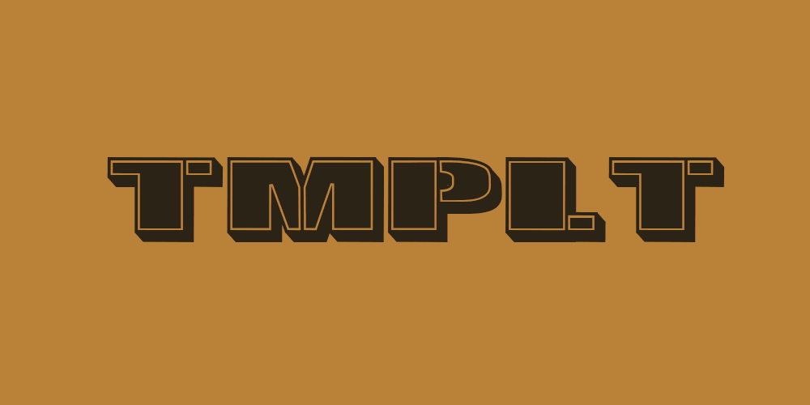

# Blender Addon Template

Cookiecutter template used to easily create blender addon.



## ⚙️ Launch

Run one of the following command in order to generate cookiecutter.

```bash
# HTTPS
cookiecutter https://git@github.com/Ni-g-3l/blender-addon-template.git

# SSH
cookiecutter git+ssh://git@github.com/Ni-g-3l/blender-addon-template.git
```

## 🔢 Versioning

We use [SemVer](http://semver.org/) for versioning. For the versions available, see the [tags on this repository](https://github.com/Ni-g-3l/blender-addon-template/tags).

## 🤹 Authors / Contributers / Attributions

* **Nig3l** - *Main Developer* - [Github](https://github.com/Ni-g-3l/)

See also the list of [contributors](https://github.com/Ni-g-3l/blender-addon-template/contributors) who participated in this project.

## 📃 License

This project is licensed under the MIT License - see the [LICENSE.md](LICENSE) file for details.

## 👏 Acknowledgments

* **Billie Thompson** - *README & Contribution Templates* - [PurpleBooth](https://github.com/PurpleBooth)
